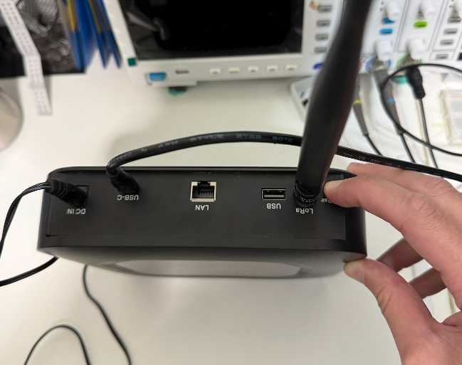

# Linxdot Firmware Reflash Guide


This document describes how to reflash the Linxdot LD1002 gateway and restore it to factory firmware.

***

### Requirements

#### Hardware

* Linxdot LD1002 Gateway
* USB cable
* Windows PC

#### Software

* Factory Tool Installer
* Latest firmware image

***

### Step 1: Install Factory Tool


Download Factory Tool Installer:

```
https://linxdot-opensource.v7idea.com/sdk/Linxdot-Factory-tool-Installer.zip
```

1. Extract the ZIP file.
2. Run the installer.
3. Follow the on-screen instructions to complete installation.

***

### Step 2: Download Latest Firmware

Download the latest firmware image:

```
https://linxdot-opensource.v7idea.com/images/linxdot-opensource-image-2.0.0.05.tar.gz
```

1. Save the firmware file to your computer.
2. Verify the file integrity before flashing.

***

### Step 3: Enter Flash Mode

<figure><figcaption></figcaption></figure>

1. Power off the LD1002 gateway.
2. Locate the BT Repair Key button on the back panel.
3. Press and hold BT Repair Key.
4. While holding the button, reconnect power.
5. Keep holding until the device enters flashing mode.
6. Factory Tool should now detect the device automatically.

***

### Step 4: Flash Firmware

<figure><figcaption></figcaption></figure>

1. Open Factory Tool.
2. Confirm the LD1002 device is detected.
3. Select the firmware file:

```
linxdot-opensource-image-2.0.0.05.tar.gz
```

4. Click Start Flashing.
5. Wait until the flashing process finishes.

<br>

> ⚠️ Do not disconnect power or USB during flashing.

***

### Step 5: Reboot Device

1. Disconnect the USB cable.
2. Power cycle the LD1002 gateway.
3. The device will boot with clean Linxdot firmware.

***

### Post Installation

<br>

After recovery, please continue with:

* Installing ChirpStack on LD1002 to enable LoRaWAN services.
* Refer to the ChirpStack installation guide for further configuration.

***

### Troubleshooting

#### Factory Tool Cannot Detect Device

* Confirm flashing mode is entered correctly.
* Check USB cable and USB port.
* Reinstall Factory Tool and USB drivers.

***

#### Flashing Failed

* Retry flashing process.
* Re-download firmware file and verify checksum.
* Ensure stable power and USB connection.

***

### Important Notice

Firmware reflashing will restore the device to factory state.

Backup all configurations before proceeding.

***

### Disclaimer

> ⚠️ Improper flashing may damage the device and may affect warranty.

> Always use official Linxdot tools and firmware images.
