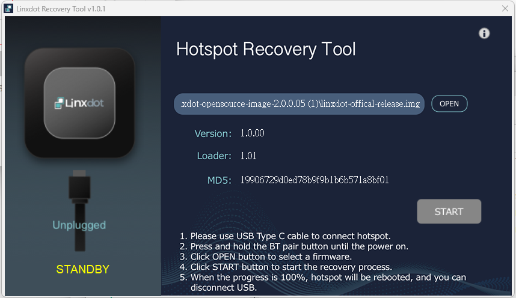

# Linxdot 韌體重刷指南

#### **本章將引導您重刷 Linxdot Hotspot，恢復至初始狀態**

#### **Linxdot LD1002 韌體重刷指南**

***

### **需求條件**

#### **硬體**

* **Linxdot LD1002** 閘道設備
* **USB 連接線**
* **Windows 電腦**

#### **軟體**

* **Factory Tool Installer**（請先下載並安裝至電腦）
* **最新韌體包**

***

### **步驟 1：安裝 Factory Tool**

1. 從官方下載 **Factory Tool Installer**。[https://linxdot-opensource.v7idea.com/sdk/Linxdot-Factory-tool-Installer.zip](https://linxdot-opensource.v7idea.com/sdk/Linxdot-Factory-tool-Installer.zip)
2. 解壓縮下載的 ZIP 文件，並運行安裝程式。
3. 按照螢幕上的指示完成安裝。

***

### **步驟 2：下載最新韌體**

1. **訪問 Linxdot 官方韌體下載頁面**。[https://linxdot-opensource.v7idea.com/images/linxdot-opensource-image-2.0.0.05.tar.gz](https://linxdot-opensource.v7idea.com/images/linxdot-opensource-image-2.0.0.05.tar.gz)
2. **下載最新韌體包** 至您的電腦。
3. 確保韌體文件已準備好，以供後續燒錄過程使用。

***

### **步驟 3：準備 Linxdot LD1002 閘道設備**

1. 拔除 **LD1002** 閘道設備的電源。
2. 找到設備背面的 **BT Repair Key**。
3. 按住 **BT Repair Key**，然後重新插入電源。
4. 設備將進入 **重新燒錄模式**，此時 **Factory Tool** 應能夠檢測到設備已連接。

<figure><figcaption></figcaption></figure>

***

### **步驟 4：燒錄韌體**

1. **打開 Factory Tool**，確認工具已成功檢測到 **LD1002**。
2. **選擇韌體文件**（例如 `linxdot-opensource-image-2.0.0.05.tar.gz`）。
3. **點擊開始燒錄**，等待燒錄過程完成。
4. **燒錄過程中請保持穩定，避免中斷**。

<figure><figcaption></figcaption></figure>

***

### **步驟 5：重新啟動 Linxdot LD1002**

1. **韌體燒錄成功後**，拔除 **USB 連接線**。
2. 重新啟動 **Linxdot LD1002 閘道設備**。
3. 設備將啟動並運行乾淨的 **Linxdot** 系統。

***

### **後續步驟**

完成韌體恢復後，請進行以下設定：

1. **在 Linxdot LD1002 上安裝 ChirpStack** 以啟用 **LoRaWAN 服務**。
2. 詳細安裝指引請參閱 **ChirpStack 安裝指南**。

***

### **疑難排解**

#### **Factory Tool 無法檢測到設備？**

* 確保 **LD1002 已進入重新燒錄模式**（按住 **BT Repair Key** 開機）。
* **檢查 USB 連接線與端口**，確保連接正常。
* **重新安裝 Factory Tool 和驅動程式**，然後再試一次。

#### **燒錄過程失敗？**

* **重試操作**，確保過程不中斷。
* **確認韌體文件未損壞**，請重新下載並驗證文件完整性。

***

### **最終說明**

執行 **Linxdot LD1002 韌體重刷**，將會重置設備至出廠狀態。在操作前，請**務必備份所有自訂配置**。\
如需進一步協助，請聯繫 **Linxdot 支援團隊** 或參考官方文檔。

**⚠️ 免責聲明：**\
**如果操作不當，重新燒錄韌體可能會導致設備無法運行，並可能影響保固。請務必使用官方工具與韌體包，以確保安全性。**
